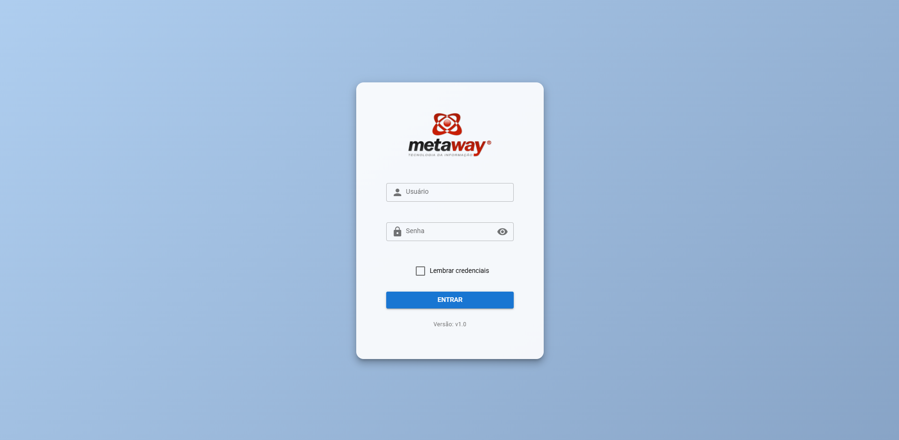
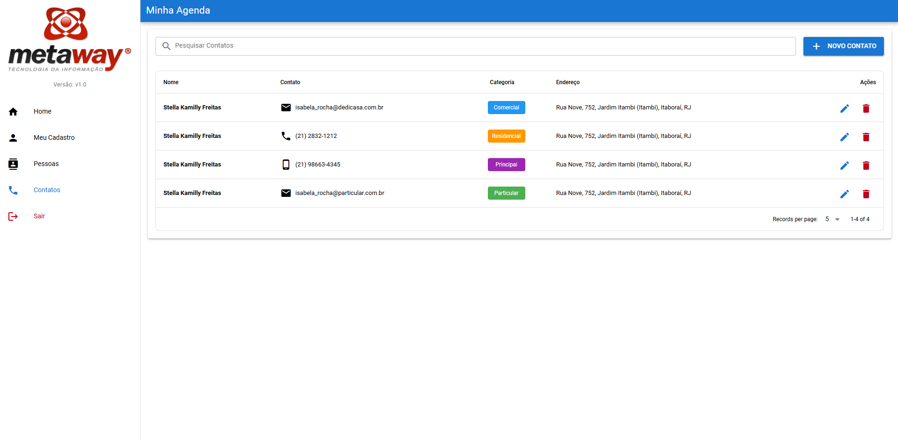

# 📌 Controle de Agenda Pessoal





## 📋 Link do projeto online

- [https://vue-test-metaway-ehcbz4kjt-rogeriojrs-projects.vercel.app/login](https://vue-test-metaway-ehcbz4kjt-rogeriojrs-projects.vercel.app/login)

## 📋 Objetivo

O objetivo deste projeto é desenvolver uma aplicação web para controle de agenda pessoal, utilizando Vue 3 com TypeScript, Pinia para gerenciamento de estado, Vue Router para navegação e Cypress para testes end-to-end.

## 📝 Documentação da API

A aplicação consome dados da API documentada em:

- 🔗 Swagger - Metaway API
- [https://demometaway.vps-kinghost.net:8485/swagger-ui/index.html](https://demometaway.vps-kinghost.net:8485/swagger-ui/index.html)

## 🔑 Credenciais de Admin

- **Usuário:** admin
- **Senha:** 12345678

ℹ️ Esta API é compartilhada, portanto os dados podem ser alterados sem aviso prévio. Recomenda-se criar um usuário administrador para uso pessoal.

## 🛠 Tecnologias Utilizadas

- Vue 3 (com TypeScript)
- Vue Router
- Pinia (Gerenciamento de estado)
- Axios (Requisições HTTP)
- Quasar (UI Framework)
- Cypress (Testes end-to-end)
- Vite (Build tool)

## 📂 Estrutura do Projeto

```
src
|   App.vue
|   main.ts
|
+---assets
|       base.css
|       logo.svg
|       main.css
|
+---components
|   |   ConfirmationDialog.vue
|   |   NavBar.vue
+---router
|       index.ts
|
+---services
|       api.ts
|
+---stores
|       auth.ts
|       contacts.ts
|       persons.ts
|       users.ts
|
+---styles
|       main.scss
|
+---types
|       index.ts
|
\---views
        ContactsView.vue
        HomeView.vue
        LoginView.vue
        MyRegistrationView.vue
        PersonsView.vue
        UsersView.vue
```

## 🚀 Como Executar o Projeto

### 📌 1. Clonar o Repositório

```sh
git clone <URL_DO_REPOSITORIO>
cd vue-test-metaway
```

### 📌 2. Instalar Dependências

```sh
npm install
```

### 📌 3. Configurar Variáveis de Ambiente

Copie o arquivo `.env.example` e renomeie para `.env`. Edite-o para definir a URL correta da API:

```sh
VITE_API_URL=https://demometaway.vps-kinghost.net:8485
```

### 📌 4. Rodar o Servidor de Desenvolvimento

```sh
npm run dev
```

A aplicação estará disponível em [http://localhost:5173/](http://localhost:5173/).

### 📌 5. Rodar Testes End-to-End (Cypress)

```sh
npm run test:e2e
```

## 📌 Funcionalidades

### 🔑 Login

- Formulário para autenticação
- Opção "Lembrar credenciais"

### 📌 Menu de Acessos

- Home
- Meu Cadastro
- Usuários (somente Admin)
- Pessoas
- Contatos
- Logout

### 🏠 Home

- Lista de contatos (diferencia favoritos de normais)
- Pesquisa, remoção, adição e edição de contatos
- Exibição da miniatura da foto do contato

### 👤 Meu Cadastro

- Edição dos dados cadastrais (exceto tipo de usuário)

### 👥 Usuários

- Listagem e edição de usuários
- Formulário de cadastro/edição

### 📇 Pessoas

- Listagem de pessoas
- Filtro por termo de pesquisa
- Remoção e edição de registros
- Exibição de miniaturas das fotos

### ☎️ Contatos

- Listagem e pesquisa de contatos
- Edição e remoção de registros

## 🔹 Requisitos e Observações

- ✅ Layout responsivo
- ✅ Mensagens de feedback em todas as operações (sucesso/erro)
- ✅ Controle de acesso:
  - Login requerido para acessar qualquer página
  - Usuários do tipo "Admin" têm acesso exclusivo à página de "Usuários"
- ✅ Formulários com:
  - Máscaras para data, CPF, CEP, email, telefone
  - Validações para campos numéricos e de senha
  - Navegação via TAB

## 🤝 Contribuição

Se desejar contribuir:

1. Fork este repositório
2. Crie um branch com sua feature:
   ```sh
   git checkout -b minha-feature
   ```
3. Commit suas mudanças:
   ```sh
   git commit -m 'Adicionando nova funcionalidade'
   ```
4. Suba o branch:
   ```sh
   git push origin minha-feature
   ```
5. Abra um Pull Request

## 📜 Licença

Este projeto está licenciado sob a **MIT License** - veja o arquivo [LICENSE](LICENSE) para mais detalhes.

---

🚀 Desenvolvido por **[Seu Nome]**
